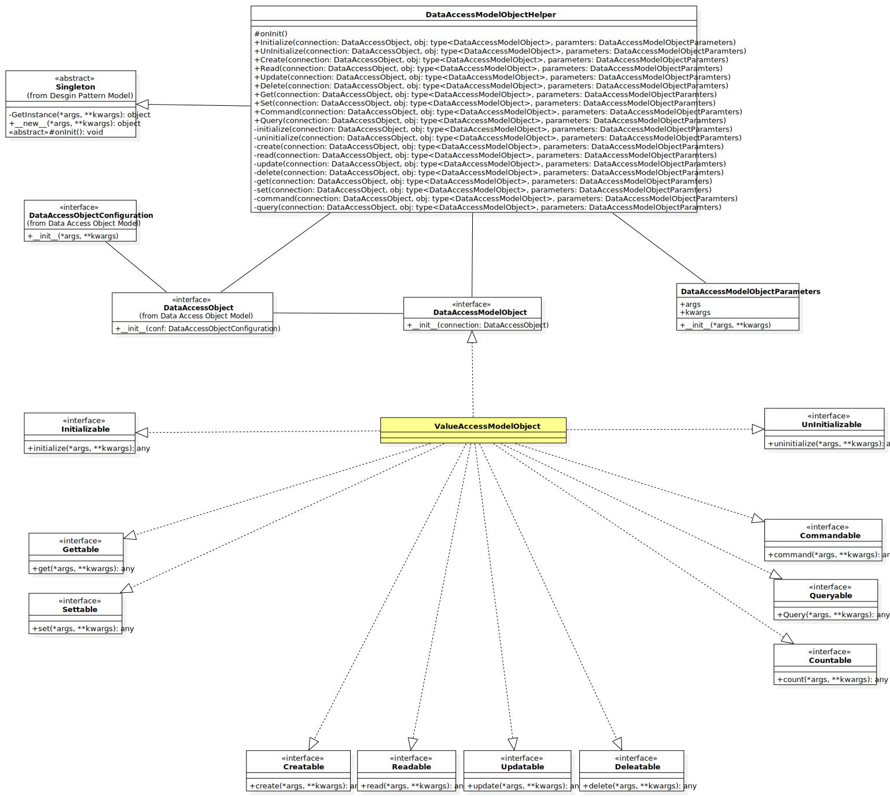

# Liquirizia.DataAccessModelObject
데이터 모델에 접근을 위한 인터페이스 및 헬퍼



## 구성
* 데이터 모델에 접근을 위한 인터페이스
* 데이터 모델의 속성에 따른 인터페이스
* 데이터 모델에 접근을 위한 헬퍼

### 데이터 모델에 접근을 위한 인터페이스
* DataAccessModelObject : 데이터 모델에 접근을 위한 최상위 인터페이스

#### 데이터 모델의 속성에 따른 인터페이스
* Initializable : 초기화 속성
* UnInitializable : 소멸 속성
* Creatable : 생성 또는 등록 속성
* Readable : 읽기 속성
* Updatable : 변경 속성
* Deletable : 삭제 속성
* Gettable : 참조 속성
* Settable : 변경 속성
* Countable : 개수 속성
* Commandable : 명령 속성
* Queryable : 질의 속성

### Data Access Model Object Helper
* DataAccessModelObjectHelper : 데이터 모델에 접근을 위한 헬퍼
* DataAccessModelObjectParameters : 데이터 모델에 접근시 파라미터 클래스

## 사용 방법

### 데이터 소스 구성
```python
from Liquirizia.Template import Singleton

# Data Source
class SampleDataObject(Singleton):
	def onInit(self, *args, **kwargs):
		self.obj = {}
		return
```

### 데이터 접근 구성
```python
from Liquirizia.DataAccessObject import (
	DataAccessObject,
	DataAccessObjectConfiguration,
)


class SampleDataAccessObjectConfiguration(DataAccessObjectConfiguration):
	def __init__(self):
		# ...
		return


class SampleDataAccessObject(DataAccessObject):
	def __init__(self, conf: SampleDataAccessObjectConfiguration):
		self.conf = conf
		self.src = None
		return

	def __del__(self):
		self.close()
		return

	def connect(self):
		self.src = SampleDataObject()
		return

	def close(self):
		self.src = None
		return


```

### 모델 구성
```python
from Liquirizia.DataAccessModelObject import DataAccessModelObject
from Liquirizia.DataAccessModelObject.Properties import *

from random import randint

# Data Access Model Object for Initialize, UnInitialize, Create, Read, Update, Delete, Get, Set, Count
class SampleModelObject(
	DataAccessModelObject,
	Initializable,
	Readable,
	Gettable,
	Settable,
):
	def __init__(self, con):
		self.con = con
		return

	def initialize(self):
		for i in range(0, 10):
			self.con.src.obj[i] = randint(0, 100)
		return

	def read(self):
		return self.con.src.obj.items()

	def get(self, key):
		if key not in self.con.src.obj.keys():
			raise RuntimeError('{} is not exist'.format(key))
		return self.con.src.obj[key]

	def set(self, key, value):
		self.con.src.obj[key] = value
		return
```

### 일반적 사용
```python
con = SampleDataAccessObject(SampleDataAccessObjectConfiguration(1, 2))
con.connect()

obj = SampleModelObject(con)
obj.initialize()

for k, v in obj.read():
	print(k, v)

obj.set(3, 10)  # set data
print(obj.get(3))  # get data

for k, v in obj.read():
	print(k, v)

con.close()
```

### 헬퍼와 함께 사용
```python
from Liquirizia.DataAccessModelObject import DataAccessModelObjectHelper, DataAccessModelObjectParameter

con = SampleDataAccessObject(SampleDataAccessObjectConfiguration(1, 2))
con.connect()

DataAccessModelObjectHelper.Initialize(con, SampleModelObject)

for k, v in DataAccessModelObjectHelper.Read(con, SampleModelObject):
	print(k, v)

DataAccessModelObjectHelper.Set(con, SampleModelObject, DataAccessModelObjectParameters(3, 10))
print(DataAccessModelObjectHelper.Get(con, SampleModelObject, DataAccessModelObjectParameters(3)))

for k, v in DataAccessModelObjectHelper.Read(con, SampleModelObject):
	print(k, v)

con.close()
```