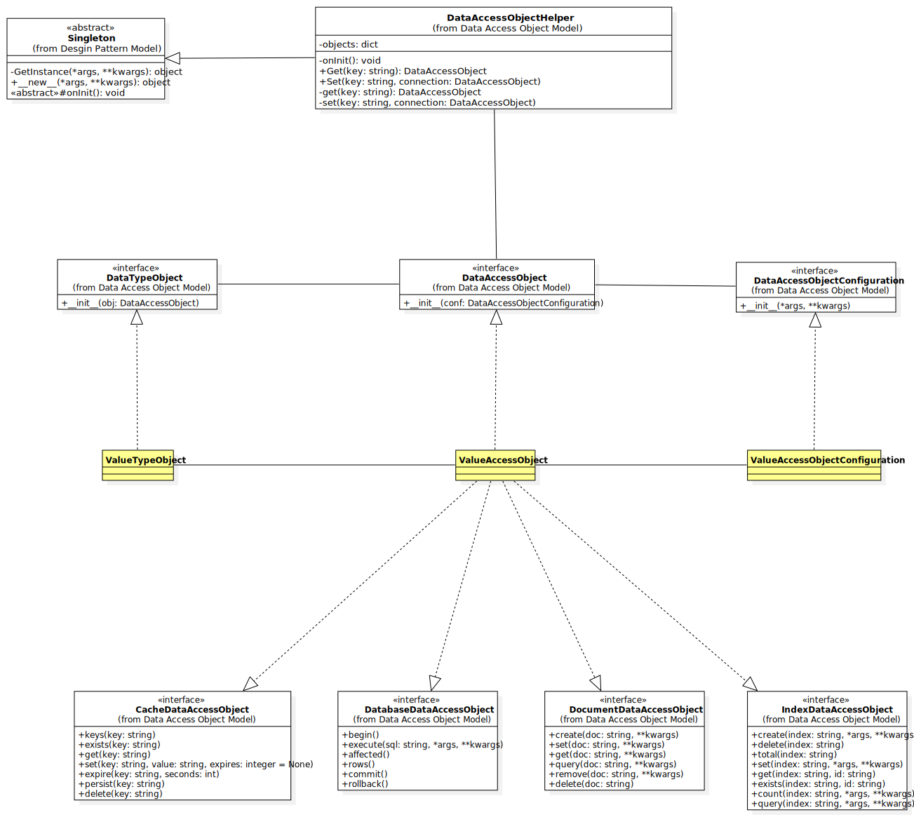

# Liquirizia.DataAccessObject
데이터 접근을 위한 객체의 인터페이스 및 헬퍼



## 구성
* 데이터 접근 헬퍼
* 데이터 접근 설정 인터페이스
* 데이터 접근 인터페이스
 
### 데이터 접근 헬퍼
싱글턴 디자인 패턴으로 프로세스 내에서 유일하다. 헬퍼에 접근 설정 클래스와, 접근 클래스를 이름으로 등록하여 어느곳에서나 이름으로 가져와 사용 가능하다

### 데이터 접근 인터페이스
접근하고자 하는 데이터 공급자에 맞추어 인터페이스를 구현하여 사용하면 된다.

### 데이터 접근 확장 인터페이스 
* 데이터베이스 - Liquirizia.DataAccessObject.Properties.Database
* 문서 - Liquirizia.DataAccessObject.Properties.Document
* 인덱스 - Liquirizia.DataAccessObject.Properties.Index
* 캐시 - Liquirizia.DataAccessObject.Properties.Cache

## 사용방법
```python
from Liquirizia.DataAccessObject import DataAccessObjectHelper  # 데이터 접근 헬퍼 임포트
from Liquirizia.DataAccessObject import (
	DataAccessObjectConfiguration,  # 데이터 접근 설정 선언을 위한 추상 설정 클래스 임포트
	DataAccessObject,  # 데이터 접근 객체 선언을 위한 추상 클래스 임포트
	DataAccessObjectError,  # 데이터 접근자 오류 클래스 임포트 
)

import sys

# 데이터 접근 설정 객체 선언
class SampleDataAccessObjectConfiguration(DataAccessObjectConfiguration):
	def __init__(self, a, b):
		self.a = a
		self.b = b
		return

# 데이터 접근 객체 선언
class SampleDataAccessObject(DataAccessObject):

	def __init__(self, conf: SampleDataAccessObjectConfiguration):
		self.conf = conf
		self.data = None
		return

	def __del__(self):
		self.close()
		return

	def connect(self):
		self.data = self.conf.a + self.conf.b
		return

	def close(self):
		self.data = None
		return

	def get(self):
		if self.data is None:
			raise DataAccessObjectError('{} is not connected and initialized'.format(self.__class__.__name__))
		return self.data

	def set(self, data):
		if not isinstance(data, int):
			raise DataAccessObjectError('{} must be int'.format(data))
		self.data = data
		return self.data


if __name__ == '__main__':

	con = None

	try:
		# Set connection
		DataAccessObjectHelper.Set(
			'Sample',
			SampleDataAccessObject,
			SampleDataAccessObjectConfiguration(1, 2)
		)

		# Get Connection
		con = DataAccessObjectHelper.Get('Sample')
		print(con.get())  # expected print 3
		print(con.set(5))  # expected print 5
		print(con.set('a'))  # expected DataAccessObjectError
	except DataAccessObjectError as e:
		print(str(e), file=sys.stderr)
	except RuntimeError as e:
		print(str(e), file=sys.stderr)
```

## 구현

### Cache
* [Redis](https://github.com/team-of-mine-labs/Liquirizia.DataAccessObject.Implements.Redis)
* [Redis Cluster](https://github.com/team-of-mine-labs/Liquirizia.DataAccessObject.Implements.RedisCluster)

### Database
* [Sqlite](https://github.com/team-of-mine-labs/Liquirizia.DataAccessObject.Implements.Sqlite)
* [PostgreSQL](https://github.com/team-of-mine-labs/Liquirizia.DataAccessObject.Implements.PostgreSQL)

### Document
* [AWS DynamoDB](https://github.com/team-of-mine-labs/Liquirizia.DataAccessObject.Implements.AWS.DynamoDB)
* [AWS DocumentDB](https://github.com/team-of-mine-labs/Liquirizia.DataAccessObject.Implements.AWS.DocumentDB)

### Index
* [AWS OpenSearch](https://github.com/team-of-mine-labs/Liquirizia.DataAccessObject.Implements.AWS.OpenSearch)
