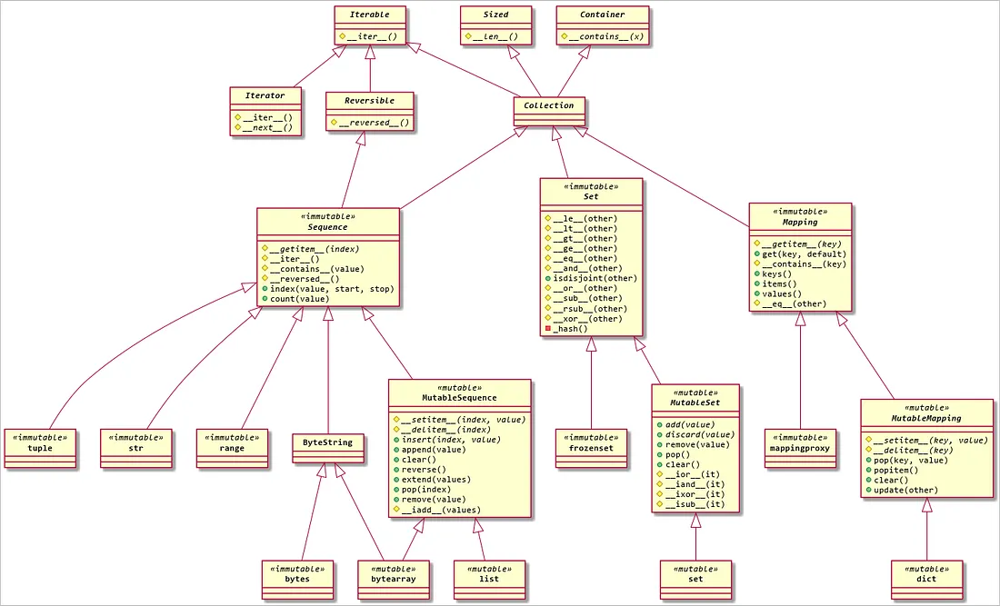

# 데이터 모델(Liquirizia.DataModel)

- [샘플 코드](sample/DataModel/Sample.py)

## 구성

- DataModel : 데이터 모델 추상 클래스
- Value : 데이터 모델 값의 설명자
- Handler : 데이터 모델 핸들러

## 지원 데이터 타입

- Integer
- Float
- String
- ByteArray
- Tuple
- List
- Set
- Dictionary
- Object

## 참고

- [Python Data Model](https://docs.python.org/3.11/reference/datamodel.html)
