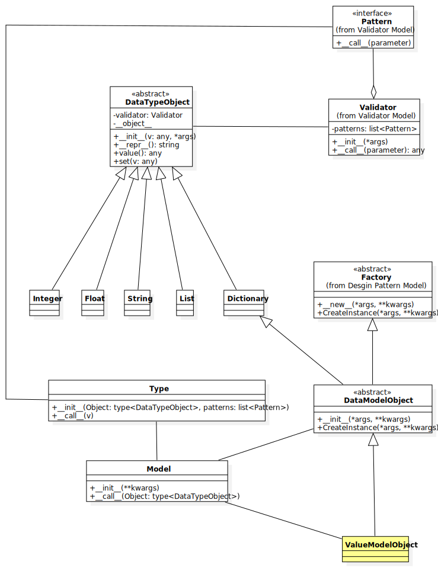

# Liquirizia.DataModelObject
데이터 모델 객체와 데이터 타입

## 구성
* DataModelObject : 데이터 모델 추상 클래스
* DataTypeObject : 데이터 유형 추상 클래스

## 지원
* ORM(Object Relational Mapping)
* DDD(Domain Driven Design/Development)
* Mutable DataModelObject and DataTypeObject
* Immutable DataModelObject and DataTypeObject

## 지원 데이터 타입
* Integer
* Float
* String
* List
* Dictionary

## 특징
* DataModelObject 는 팩토리 메소드 디자인 패턴로 Value Object 를 생성 한다.
* DataModelObject 는 클래스 이며, Value Object 는 인스턴스 이다.
* Mutable DataModelObject 에 따라 생성된 Value Object 는 변경 가능 한다.
* Immutable DataModelObject 에 따라 생성된 Value Object 는 변경 불가능 한다.
* DataModelObject 에 입력되는 값은 Validator 를 통해 검증 가능 하다.
* 기본 DataModelObject 는 Mutable DataModelObject 이다.

## 샘플
* [변경 가능한 데이터 모델](sample/DataModelObject/Mutable/Sample.py)
* [변경 불 가능한 데이터 모델](sample/DataModelObject/Immutable/Sample.py)
 
## ToDo
* 데이터 시리얼 라이저
* 데이터 타입 지원

### 데이터 타입 지원
* Boolean
* Complex
* Bytes
* Set
* Decimal
* DateTime
* Date
* Time
* Timestamp