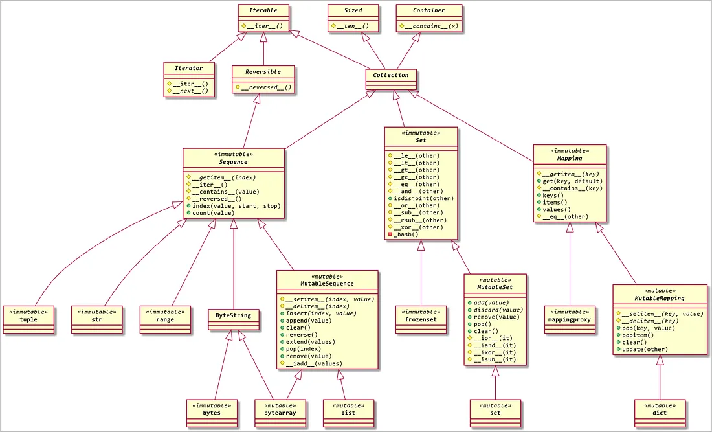

# Liquirizia.DataModelObject

- [샘플 코드](sample/DataModelObject/Sample.py)

## 구성
- DataModelObject : 데이터 모델 추상 클래스
- DataModelObjectHandler : 데이터 모델 속성 값의 변화에 대한 핸들러
- DataAttributeObject : 데이터 모델 속성 클래스

## 지원 데이터 타입
- Integer
- Float
- String
- Tuple
- List
- Dictionary
- Object

## 기타
### 파이썬의 추상 자료형

## TODO
- 데이터 시리얼 라이저 지원

